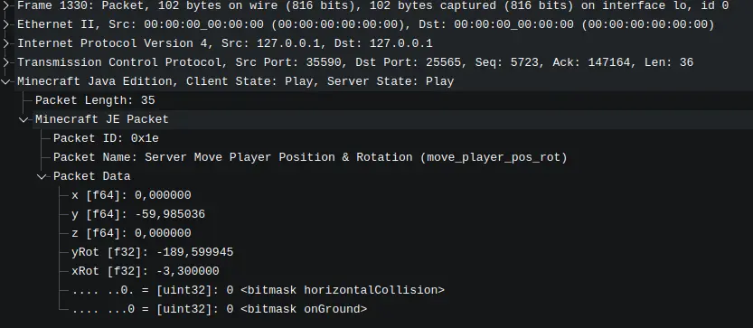

Este documento describe cómo depurar el tráfico de red de Minecraft para inspeccionar cómo los paquetes son enviados.

## Prerequisitos

Para empezar, **tienes que desactivar la compresión y el encriptado**.
El límite de la compresión debe ser puesto a **1024**.
Puedes encontrar este ajuste en `config/steel_config.json5`, que es generado tras la primera ejecución del servidor.

Vas a necesitar:

* Un **servidor local de Minecraft**
* **Wireshark** ejecutándose de fondo con permisos de administración (o los permisos adecuados) captando el tráfico de `localhost`

Los paquetes captados pueden ser comparados con la documentación oficial del protocolo:
[https://minecraft.wiki/w/Java_Edition_protocol/Packets](https://minecraft.wiki/w/Java_Edition_protocol/Packets)

Esto ayuda a entender los tipos de paquete y lo que describen.

## Configuración de Wireshark

Puedes iniciar Wireshark en cualquier momento para observar los paquetes, pero para una lectura más sencilla, es recomendado compilar y usar un **Wireshark dissector plugin**.

### Minecraft Wireshark Dissector

Repositorio:
[https://github.com/Nickid2018/MC_Dissector](https://githsteel_configub.com/Nickid2018/MC_Dissector)

Requisitos:

* **Wireshark 4.6** (recomendado)

Nuestra recomendación es que compiles este plugin por ti mismo empleando las instrucciones en el archivo `ci.yaml` del repositorio.

**Para Linux:**\
Tras compilarlo, copia el archivo `.so` a:

```bash
~/.local/lib/wireshark/plugins/<Wireshark Version>/epan
```

**Para Windows:**\
Tras compilarlo, copia el archivo `.dll` a:

```bash
plugins/<Wireshark Version>/epan
```

Ajusta la ruta de acuerdo a tu versión de Wireshark.

### Repositorio de datos del protocolo

Clona el repositorio de datos del protocolo:

[https://github.com/Nickid2018/MC_Protocol_Data](https://github.com/Nickid2018/MC_Protocol_Data)

## Configuración de Wireshark

Inicia Wireshark (en Linux, para la captura de tu mismo dispositivo, tu usuario debe estar en el grupo `wireshark`).

Ahora navega hasta:

**Preferencias → Protocols → MCJE**

Selecciona el protocolo y configura la ruta al clon de `MC_Protocol_Data`.
Tras ello, **reinicia Wireshark**.

## Filtros de muestreo útiles

Para poder ver de forma correcta el tráfico de Minecraft, usa este filtro:

```
tcp.port == 25565 || udp.port == 25565
```

## Resultado

Al final, los paquetes aparecerán de una forma **mucho más legible** que la información de red en bruto, haciendo el depurado del protocolo mucho más sencillo.



## Recursos adicionales

Estos recursos pueden ayudarte a tener un entendimiento mayor:

- [Como decompilar Minecraft](../../../getting-started/decompile-minecraft)
- [https://minecraft.wiki/w/Java_Edition_protocol/Packets](https://minecraft.wiki/w/Java_Edition_protocol/Packets)