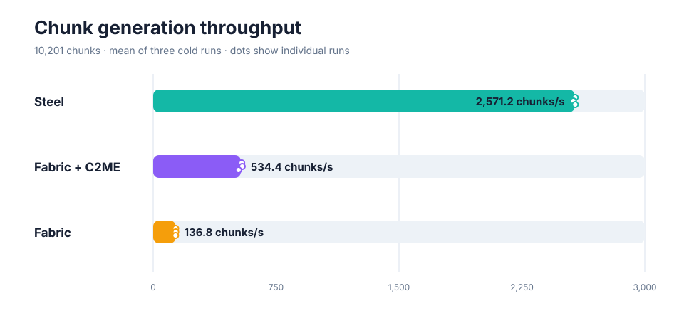
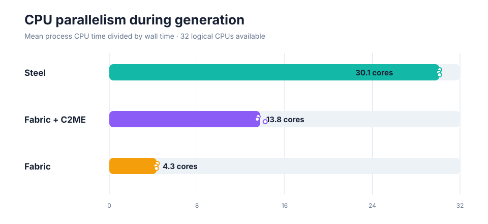
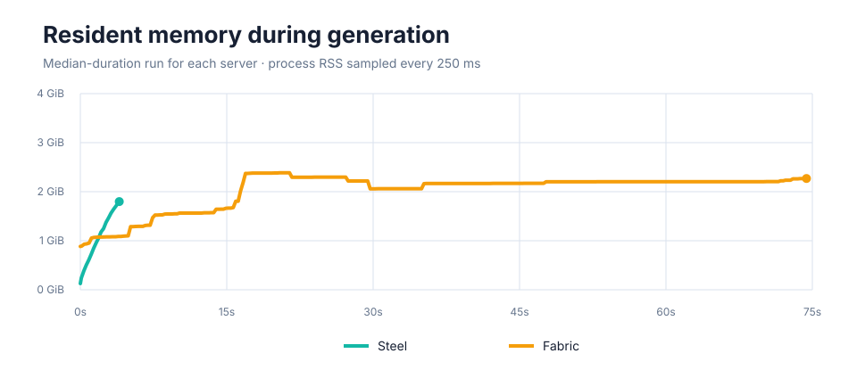
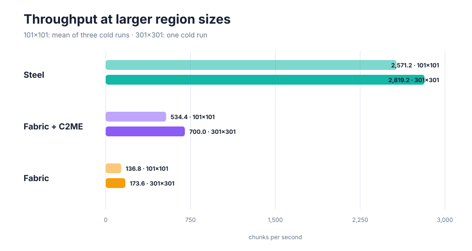

Steel's first published benchmark focuses on the work it currently does best: generating terrain. We compared a native Steel build with Fabric using [Chunky](https://modrinth.com/plugin/chunky).

:::note[Fabric is the vanilla baseline]
Throughout this page, **Fabric** means a Minecraft Java Edition 26.2 server with Fabric Loader, Fabric API, and Chunky, but no performance mods. We use it as a repeatable stand-in for vanilla: Chunky defines a fixed pregeneration area while Minecraft's vanilla world generator does the work.
:::

On this machine, Steel generated the 10,201-chunk test area **18.8 times as fast as Fabric** across three runs.

| Server | Median time |  Mean throughput | Median peak RSS | Mean CPU use |
| ------ | ----------: | ---------------: | --------------: | -----------: |
| Steel  |      3.95 s | 2,581.8 chunks/s |        1.79 GiB |   30.2 cores |
| Fabric |     74.42 s |   137.2 chunks/s |        2.47 GiB |    4.4 cores |

Times and memory figures are medians of three runs. Throughput and CPU use are arithmetic means. Higher throughput is better; lower time and memory are better.



Parallelism is a large part of the result. Steel kept an average of 30.2 logical CPU cores busy during the measured interval, compared with 4.4 for Fabric.



### Adjusted for CPU use

Dividing throughput by average CPU use gives a rough measure of work completed per CPU-second:

| Server | Chunks per CPU-second | Relative to Fabric |
| ------ | --------------------: | -----------------: |
| Steel  |                 85.51 |              2.75× |
| Fabric |                 31.15 |              1.00× |

This adjustment narrows the headline gap, but does not remove it: Steel generated about **2.75 times as many chunks per CPU-second as Fabric**. It is not a substitute for wall-clock throughput—unused cores cannot make a generation job finish sooner—but it gives a rough view of per-core efficiency alongside parallel scaling in this CPU-bound test.

## Memory use

Peak resident memory was lowest for Steel in this test. Its median peak was 1.79 GiB, compared with 2.47 GiB for Fabric.

The graph below uses the median-duration run from each server. A line ending earlier means that server finished generation earlier; it does not mean memory fell to zero.



Resident set size measures the whole server process, not only live chunk data. For Java, this includes the JVM and committed heap pages; for Steel, it includes the native process and allocator. The metric shows what the operating system kept in memory during this workload, but it does not directly compare Java heap usage with Rust allocations.

## Larger region

We also ran each server once over a 301-by-301 area: 90,601 chunks, or 8.88 times as much target terrain. The larger run gives the schedulers more time to warm up and is a better indication of sustained throughput, but a single trial does not provide the same confidence as the repeated 101-by-101 result.

| Server |    Time |       Throughput | Peak RSS | Average CPU use | Chunks per CPU-second |
| ------ | ------: | ---------------: | -------: | --------------: | --------------------: |
| Steel  | 32.14 s | 2,818.6 chunks/s | 3.98 GiB |      29.4 cores |                 95.86 |
| Fabric | 8:37.39 |   175.1 chunks/s | 3.35 GiB |       4.1 cores |                 42.68 |

Steel was **16.10 times as fast as Fabric** in this run. After dividing by average CPU use, Steel completed **2.25 times as many chunks per CPU-second as Fabric**.

Both servers posted higher throughput over the larger area: Steel improved by 9.2%, and Fabric by 27.6% relative to their 101-by-101 means. Peak RSS is not directly comparable across region sizes because larger runs keep more generated and pending chunk data resident.



## Methodology

The primary benchmark generated a fresh 101-by-101 square of fully generated overworld chunks centered on chunk 0,0. That is 10,201 target chunks covering approximately 2.61 square kilometres. The scaling check used a 301-by-301 square, or 90,601 target chunks covering approximately 23.19 square kilometres. The benchmark used this fixed seed:

```text
8500081009970950196
```

The seed was chosen for its unusually dense variety: its finder [reported every biome and structure within 1,000 blocks of 0,0](https://www.reddit.com/r/minecraftseeds/comments/1tf9iz2/ive_been_seedfinding_for_close_to_3_years_now/), giving a compact benchmark area broad terrain and structure coverage.

The common settings were:

- Minecraft Java Edition 26.2
- structures enabled
- no connected players
- a new world directory for every run
- world storage on the same `tmpfs` filesystem
- three cold runs per server at 101-by-101, plus one cold run at 301-by-301
- process CPU time and RSS sampled every 250 milliseconds
- Steel pregeneration window size set to 64 chunks (`PREGEN_WINDOW_SIZE=64`)

Putting the worlds on `tmpfs` removes the storage device from the comparison. Chunk serialization, compression, and saving still run, but physical disk speed does not dominate the result.

Steel's measured interval starts at `Preparing spawn area` and ends at `Spawn area prepared`. The Fabric intervals start when Chunky reports `Task started` and end at `Task finished`. Startup, registry loading, spawn selection, and shutdown are outside the measured interval for both servers.

### Software

| Component     | Version                                                          |
| ------------- | ---------------------------------------------------------------- |
| Steel         | commit `c9f6a90b843a984b7c2c522ed7418098083c4780`, clean worktree |
| Fabric Loader | 0.19.3                                                           |
| Fabric API    | 0.155.2+26.2                                                     |
| Chunky        | 1.5.3                                                            |
| Java          | OpenJDK 25.0.4, G1GC, 512 MiB initial and 8 GiB maximum heap     |

The baseline Fabric configuration contained only Fabric Loader, Fabric API, and Chunky. Performance mods were intentionally not installed; the limitations below explain why.

### Hardware

| Component | Test system                              |
| --------- | ---------------------------------------- |
| CPU       | AMD Ryzen 9 9950X, 16 cores / 32 threads |
| Memory    | 123.4 GiB system memory                  |
| OS        | Arch Linux, kernel 7.1.4-arch1-1         |
| Storage   | `tmpfs` for generated worlds             |

### Reproducing the benchmark

The benchmark harness and chart renderer are tracked TypeScript files and run with Bun. From the documentation repository:

```sh
PREGEN_WINDOW_SIZE=64 bun run benchmark -- \
  --steel ../SteelMC \
  --fabric ../fabric_server \
  --output /tmp/steel-benchmark \
  --runs 3 --side 101
```

For the single larger-region run, change the last line to `--runs 1 --side 301` and use a separate output directory.

The runner creates a new temporary world for every trial, verifies pinned Chunky and Fabric API downloads by SHA-512, samples Linux `/proc`, and writes raw logs plus JSON and CSV results. The default `all` profile rotates the order of Steel and Fabric between runs. Use `--profile steel` or `fabric` to run one server.

To regenerate the tracked charts from the tracked data:

```sh
bun run benchmark:render
```

## Individual runs

| Server | Run |     Time |       Throughput | Peak RSS | Average CPU use |
| ------ | --: | -------: | ---------------: | -------: | --------------: |
| Steel  |   1 |  3.940 s | 2,588.9 chunks/s | 1.79 GiB |     30.19 cores |
| Steel  |   2 |  3.959 s | 2,576.7 chunks/s | 1.79 GiB |     30.17 cores |
| Steel  |   3 |  3.954 s | 2,579.9 chunks/s | 1.80 GiB |     30.22 cores |
| Fabric |   1 | 75.088 s |   135.9 chunks/s | 2.35 GiB |      4.42 cores |
| Fabric |   2 | 74.419 s |   137.1 chunks/s | 3.63 GiB |      4.40 cores |
| Fabric |   3 | 73.547 s |   138.7 chunks/s | 2.47 GiB |      4.40 cores |

The 301-by-301 table above contains one run per server, so it is not repeated here.

The machine-readable source data used for the tables and graphs is stored alongside the documentation as `results.csv`, `results.json`, and `samples.csv`.

## Limitations

:::caution[Read this before quoting the results]
This is a focused world-generation benchmark, not a claim that Steel is 18.8 times faster at every server workload.
:::

- **The repeated area is intentionally modest.** The 101-by-101 test was chosen so vanilla Fabric could be repeated three times. The 301-by-301 result demonstrates warmup effects, but it is only one run and should not be treated as a stable average.
- **The generated work is not perfectly identical.** Steel currently disables the entity-spawning generation stage because most generated entities are not implemented. Vanilla Fabric performs that stage. Both configurations otherwise request fully generated chunks with structures and lighting.
- **Fabric is our vanilla baseline, not an optimized modded server.** Fabric Loader provides the mod environment, while Fabric API and Chunky let us define and run the same pregeneration task each time. We intentionally excluded performance mods because they often need workload-specific tuning. A poorly configured test could understate what they can do. We welcome reproducible benchmark contributions from people experienced in configuring a particular mod.
- **The benchmark favours CPU work.** `tmpfs`, an idle server, and no players reduce disk and gameplay interference. A live server on persistent storage will behave differently.
- **This is one machine, seed, dimension, and server revision.** Results should be reproduced on other hardware and expanded to the Nether, the End, chunk loading, chunk sending, ticking, and player concurrency before drawing broader conclusions.

## Future benchmarks

The next useful additions are:

- responsibly tuned Fabric performance-mod configurations contributed by people experienced with those mods
- repeated 301-by-301 generation on additional machines
- physical NVMe storage, including world size and bytes written
- the Nether and the End
- generated-chunk loading from disk
- chunk sending to one and multiple clients
- tick time and memory under simulated players
